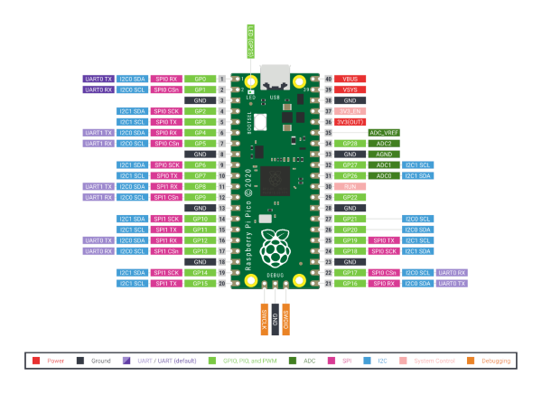

# General Setup
- hold pico power button to boot rpi pico
- flash [uf2](Docs\software\firmware) file for circuitpython
- Include used libraries from lib folder
- Utilize onboard led!
  - gpio 25

# PICO Pin Diagram

