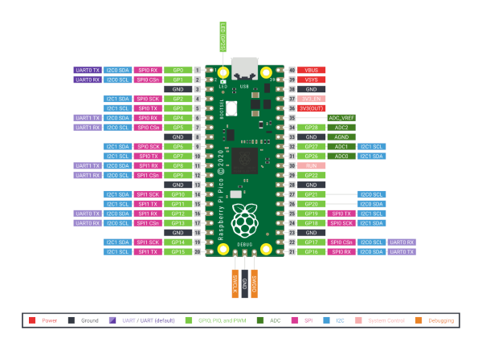
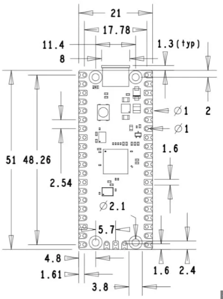

# Pi Pico

## PinOut

# Resources
- [Datasheet](https://datasheets.raspberrypi.com/pico/pico-datasheet.pdf)
- [Digikey](https://www.digikey.com/en/products/detail/raspberry-pi/SC0917/16608257) 
- [RaspberryPi](https://www.raspberrypi.com/documentation/microcontrollers/raspberry-pi-pico.html)
### PICO W 
- [Access Point](https://www.instructables.com/Creating-a-Wireless-Network-With-Raspberry-Pi-Pico/)

## Dimensions
