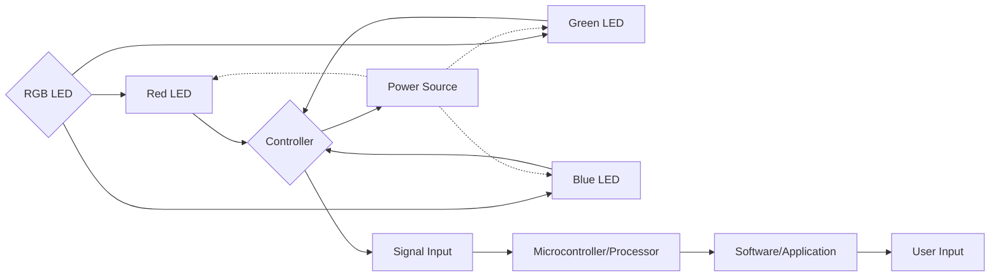
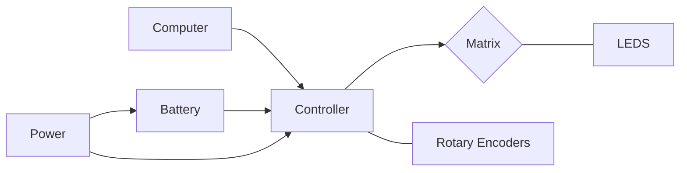
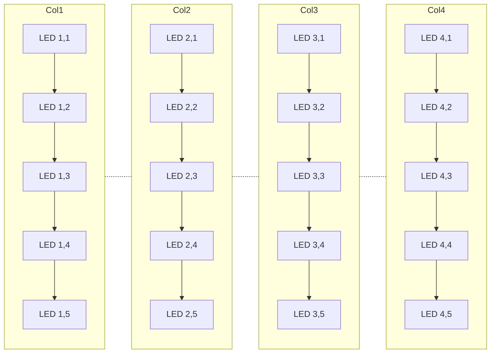

# Diagrams

```mermaid
flowchart LR
    A{RGB LED} --> B[Red LED]
    A --> C[Green LED]
    A --> D[Blue LED]
    B --> E{Controller}
    C --> E
    D --> E
    E --> F[Power Source]
    E --> G[Signal Input]
    G --> H[Microcontroller/Processor]
    F -.-> B
    F -.-> C
    F -.-> D
    H --> I[Software/Application]
    I --> J[User Input]
```
Awesome

## System Schematic

```mermaid
flowchart LR
    1{Matrix}
    2[Controller]
    3[Battery]
    4[Power]
    5[LEDS]
    6[Computer]
    7[Rotary Encoders]
    6-->2
    2-->1
    2---7
    1---5
    3-->2
    4-->3
    4-->2

```

```mermaid
graph LR
    subgraph Col1
        A1[LED 1,1] --> A2[LED 1,2]
        A2 --> A3[LED 1,3]
        A3 --> A4[LED 1,4]
        A4 --> A5[LED 1,5]
    end

    subgraph Col2
        B1[LED 2,1] --> B2[LED 2,2]
        B2 --> B3[LED 2,3]
        B3 --> B4[LED 2,4]
        B4 --> B5[LED 2,5]
    end
    

    subgraph Col3
        C1[LED 3,1] --> C2[LED 3,2]
        C2 --> C3[LED 3,3]
        C3 --> C4[LED 3,4]
        C4 --> C5[LED 3,5]
    end

    subgraph Col4
        D1[LED 4,1] --> D2[LED 4,2]
        D2 --> D3[LED 4,3]
        D3 --> D4[LED 4,4]
        D4 --> D5[LED 4,5]
    end

    Col1-.-Col2-.-Col3-.-Col4
```