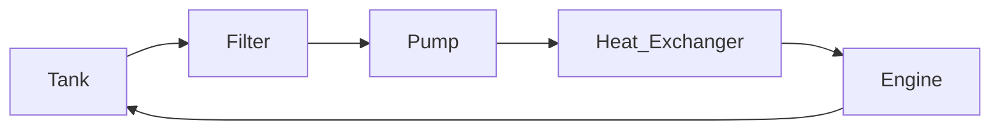

# Ancillaries
---
## Systems
### Water System
1. [Tank](https://www.amazon.com/dp/B082HSM13C?ref=product_details&th=1)
   1. 6 AN Fittings
      1. [McMaster to NPT](https://www.mcmaster.com/50695K173/)
         1. use [copper](https://www.mcmaster.com/50675K173/) for water given corrosion...
   2. 
2. Filter
3. Pump
4. Heat Exchanger
   1. [Amazon](https://www.amazon.com/dp/B07VB7M6DN?psc=1&ref=product_details)
   2. Fittings
5. Engine
### Simplified Enclosure 

---
### Oil System
1. Oil Tank
2. Filter
3. Pump
4. Regulator
   1. Supply Line
      1. Pressure and Temp
      2. Engine
   2. Return Line
      1. Tank

---
### Fuel System
1. Fuel Tank
2. Filter
3. Priming Pump
4. Solenoid
5. Flowmeter
6. Pump
   1. [Motor Controller](https://www.amazon.com/Cytron-Bi-Directional-6V-30V-Motor-Driver/dp/B07RQFN485/ref=sr_1_1?crid=3MWP173RZZC5D&dib=eyJ2IjoiMSJ9.qv_kA-KXRLQ4yCXPaG9xzUAEG6rWSsnWPimhEwGovpMgYdPtfpDbLHo1AkLFfDeetQMMGDkmnFs--wxtSYoZ6kauIcwyl0nPZI2XQM5Zzx6_yDmSC7vOTMGx2O42k_zNd_usa7aCd0PY0cPYPUWOX6FvPU2YRmNSFauk5zY_4QU6xpfE69wj9F5jTS3xyNVjRnXeoWFjbIhWCd7s8TfAre3_tAlVE1mBVg2AzN4xIXA.ibYv-4heNOVQYcCCKMMlbqBjgQzLr-mWsBCCu02au1Q&dib_tag=se&keywords=bidirectional+motor+controller&qid=1711390033&sprefix=bidirectional+motor+controll%2Caps%2C153&sr=8-1)
7. Manifold
   1. Pressure Sensors
   2. Temp Sensors
   3. Heater
8. Engine
---

## Equipment
### Walbro Pump 
- [Walbro 255 LPH](https://www.summitracing.com/parts/wal-gss342/overview/)
- [Fittings](https://www.mcmaster.com/50785K844/)
