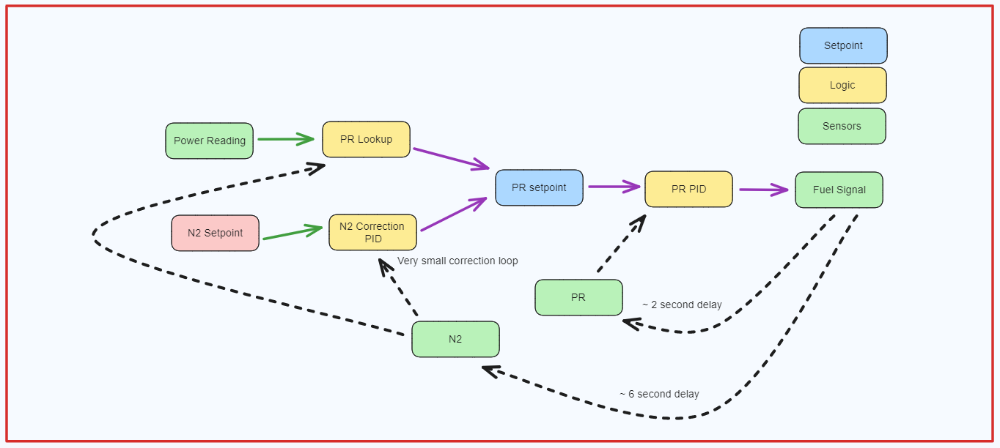

# Control Logic

## Diagram
- N2 is only setpoint
- Load following

### Control
2 control loops in order to control both PR and N2

- Primary: PR Control 
  - Adjust fuel flow to maintain PR setpoint
- Secondary: N2 Control
  - Slowly adjust PR setpoint to maintain N2 Control
