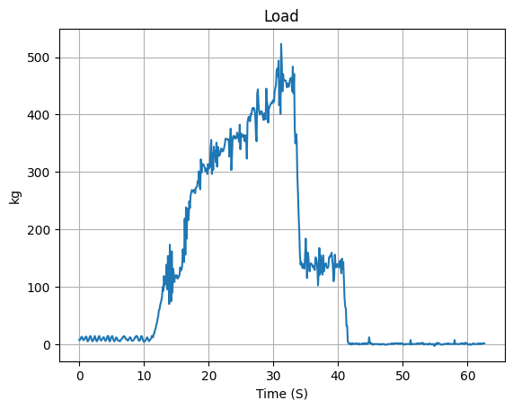
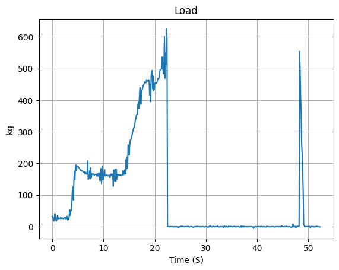

## Axial Force Measurement
- [Amplifier Manual](https://www.ato.com/Content/doc/ATO-load-cell-amplifier-user-manual-ATO-LCTR-OAR.pdf)
  - Modify calibration range to effectively change gain...
  - 4-20 output with 220 ohm resistor
  - 300 kg load cell
    - taken up to 600 kg. Output changes to 0 when over max on amplifier...
    - 1473.6 units/kg
  - 2000 kg load cell
    - calibrating range: 990,000
    - First test... plastic deformation of printed part 
      - 
    - Shaft color extraction
      - 
    - 
- [Amplifier](https://www.google.com/url?q=https://www.amazon.com/gp/product/B08CMF1VDG/ref%3Dppx_yo_dt_b_search_asin_title?ie%3DUTF8%26psc%3D1&source=gmail&ust=1690416005383000&usg=AOvVaw0OwkifFDTYfMN1AWltyKEb)
- [Load Cell](https://www.amazon.com/gp/product/B0785MXVYK/ref=ppx_yo_dt_b_search_asin_title?ie=UTF8&psc=1)
