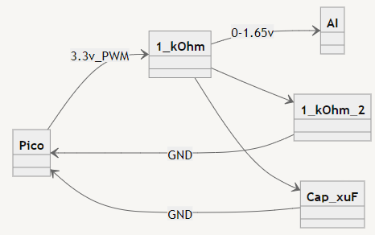
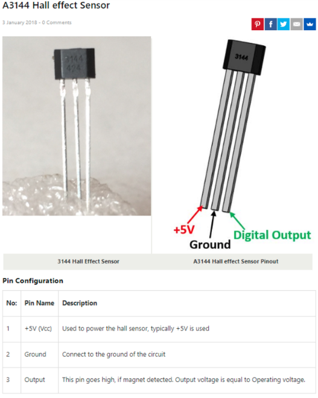

# Micro Controller Notes

### Simulating HSC

- 1 kOhm resistor on trigger
- Emitter - GND
- Base - signal (trigger)
- Collector - PLC input (24v High)
- 

### Analog PWM
- 

### Hall Effect Sensors
- 
- [analog](https://www.amazon.com/dp/B07DWXCTFL?psc=1&ref=ppx_yo2ov_dt_b_product_details) and [digital](https://www.amazon.com/dp/B09PG3PGH6?psc=1&ref=ppx_yo2ov_dt_b_product_details) Sensors
- vary pull up resistance on digital to alter trigger level
