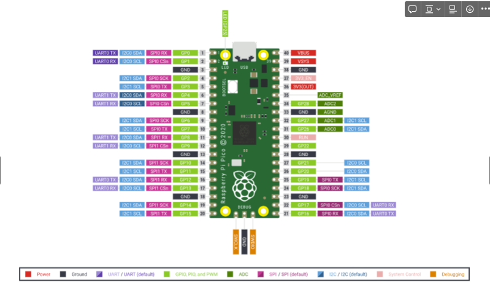
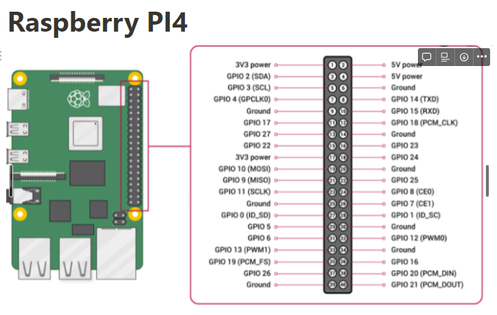

# Raspberry PI Notes

## PICO

onboard led = gpio25
[micropython](https://docs.micropython.org/en/v1.8.2/esp8266/esp8266/tutorial/filesystem.html)
hold bootsel on power up
flash with uf2 file
*sudo chmod a+rw /dev/ttyACM0*

## Raspi Notes

- [Headles Pi Zero Set up](https://desertbot.io/blog/ssh-into-pi-zero-over-usb)
- raspi-config
- default user, pass: pi, raspberry
- Login: ssh pi@(IP or raspberrypi). Username: pi, Pass: greyman
- VNC pass: greyman69
- sudo su
- source virtual_env/bin/activate
- python x.py

sudo nano /etc/dhcpcd.conf

interface eth0

static ip_address=<desired IP address>/24

Press Ctrl+O to save the file, and then press Ctrl+X to exit the text editor.

sudo service networking restart

Screens: Run screen that stays on so you don't have to be constantly connected

- Run screen: screen bash
- Show screens: screen -list
- Connect to screen: screen -r (name if multiple)
- End Screen: CTRL+A then D
- Kill Screen: CTRL D

Trouble shooting

- ssh key issues: ssh-keygen -R "your server hostname or IP"

### Wiki Notes

- pip install rpi.gpio
- linux - use gedit for text editing (sudo gedit file)
- Install Virtual Environment : pip install virtualenv
- Create Virtual Environment: python3 -m venv env
- Activate VEnv: linux- source env/bin/activate
- windows- .\env\Scripts\activate
- setting static ip... do not mess with dns to avoid issues with internet...