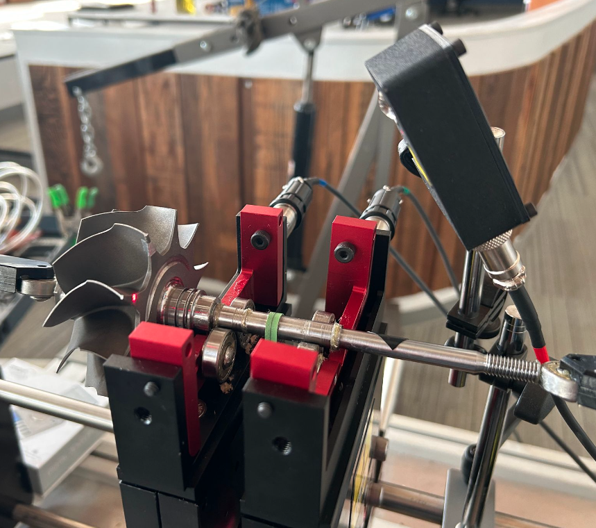
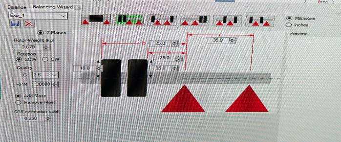
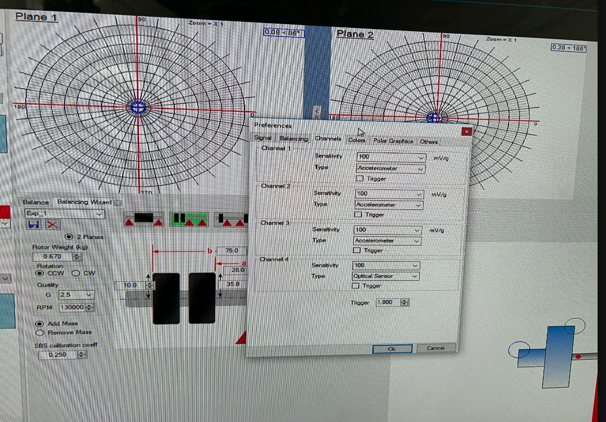
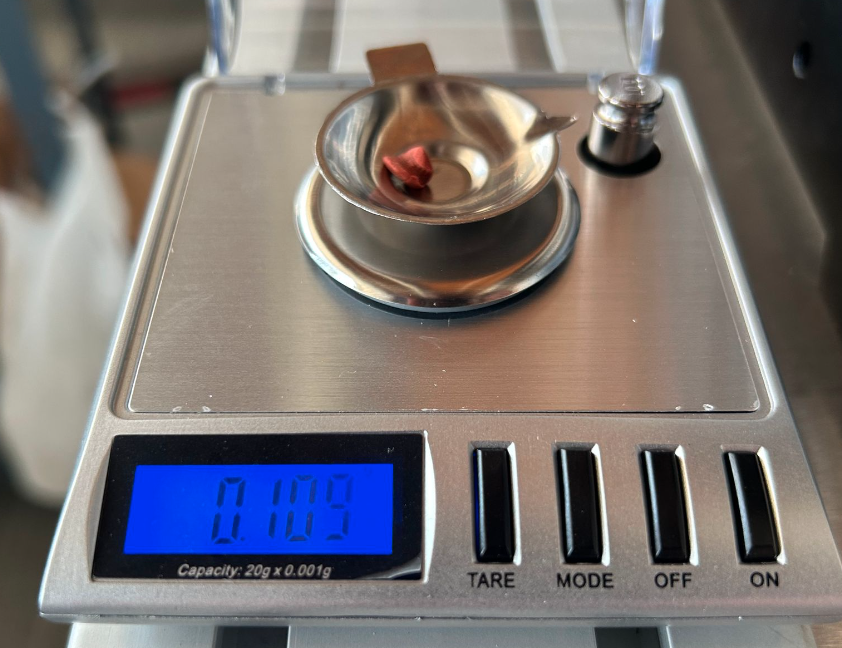
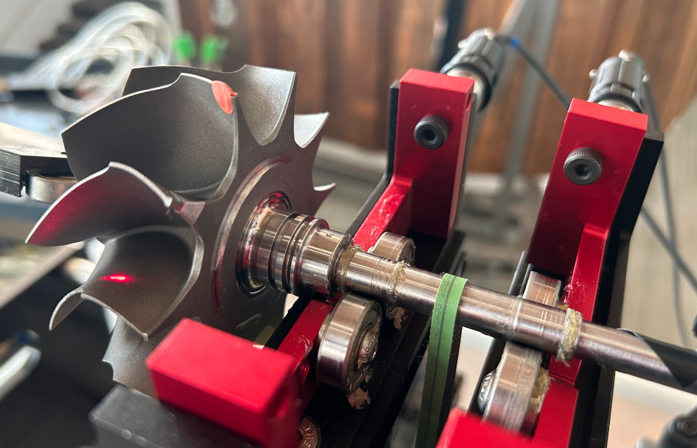

## Overview

- commisioning of EI-30 balancer
- experimenting with already balanced turbine shaft
- placing balancing putty on blades do not match expectations
  - confirm software setup correctly
  - confirm experimental setup looks good

### Hardware Setup
| | | |
|---|---|---|
||||

### Software Setup
| | | |
|---|---|---|
||||

### Experimental Balance

- Initial run showing at plane 1 is balanced

- Weighing out .109 gram balancing putty and adding to plane 1. Expecting results to suggest adding counter mass of equal weight and opposite position

- Results indicate imbalance, but size of mass and location seem incorrect (0.009g).
