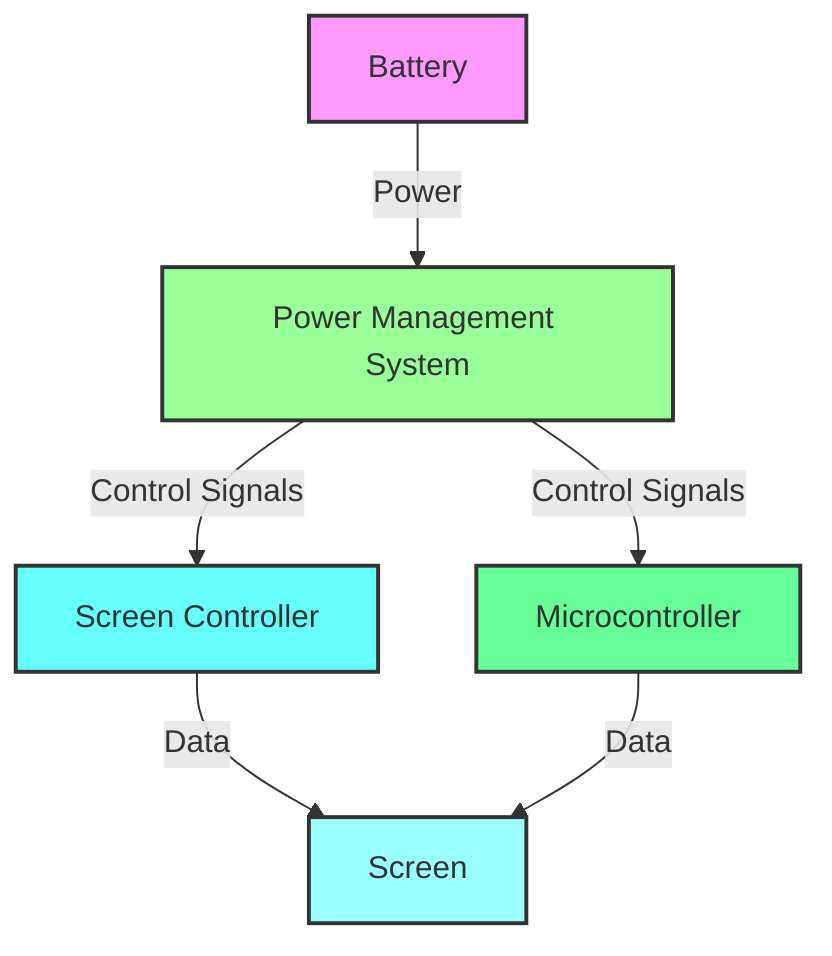
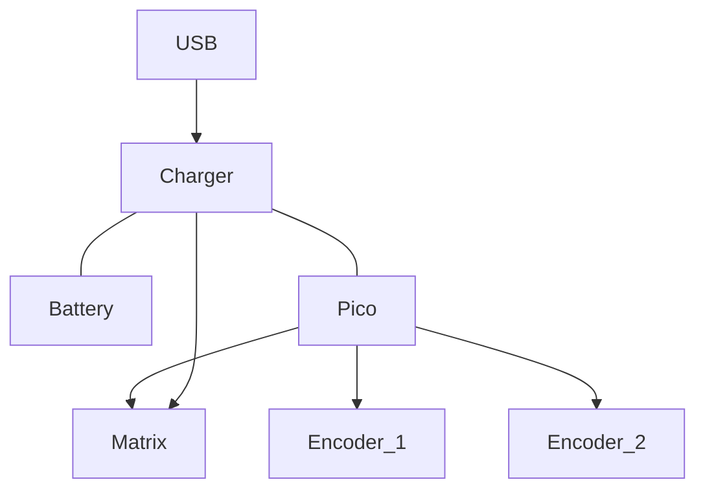

# Diagrams
## [Drawio](https://drawio-app.com/blog/import-from-csv-to-drawio/)
great tool for quick diagrams and vscode supported
## [Excalidraw](https://excalidraw.com/)
Amazing browser based diagraming
## Mermaid

