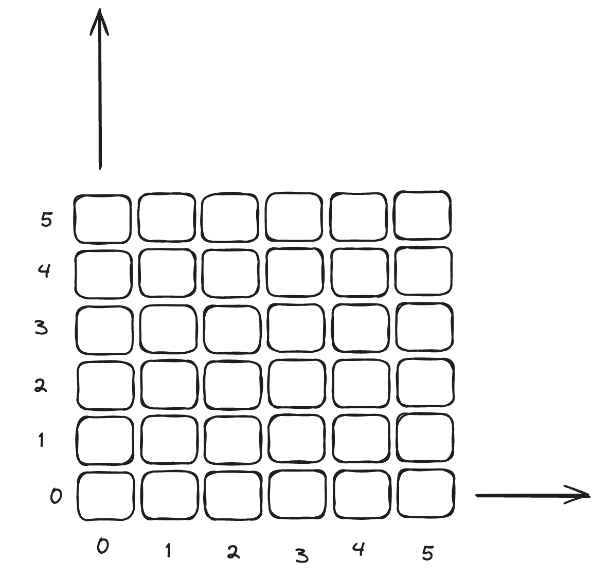

Sure, let's break it down:

**Understanding LEDs:**

LEDs, or Light-Emitting Diodes, are semiconductor devices that emit light when an electric current passes through them. They are widely used in various applications due to their efficiency, durability, and versatility.

**Key Features of LEDs:**

1. **Efficiency:** LEDs are highly efficient at converting electrical energy into light, making them energy-efficient alternatives to traditional light sources.

2. **Durability:** LEDs have a long lifespan compared to incandescent bulbs and fluorescent lights, reducing maintenance and replacement costs.

3. **Color Options:** LEDs are available in various colors, including red, green, blue, and white. RGB LEDs combine these primary colors to produce a wide range of hues.

4. **Compact Size:** LEDs are compact and lightweight, allowing for flexibility in design and integration into various devices and applications.

**Applications of LEDs:**

1. **General Lighting:** LEDs are used for general lighting purposes in homes, offices, and outdoor environments, offering energy-efficient illumination and customizable lighting solutions.

2. **Display and Signage:** LEDs are employed in digital displays, signage, and information boards to create vibrant visuals, messages, and advertisements.

3. **Indicator Lights:** LEDs serve as indicator lights in electronic devices, appliances, and automotive applications, providing status indication and user feedback.

4. **Decorative Lighting:** LEDs are utilized in decorative lighting applications, such as holiday decorations, architectural lighting, and mood lighting, due to their versatility and color options.

**Understanding LED Matrices:**

LED matrices are arrays of LEDs organized in rows and columns to form a display grid. They provide a platform for creating visual displays, signs, and animations by controlling the illumination of individual LEDs within the matrix.

**Key Features of LED Matrices:**

1. **Resolution:** LED matrices vary in resolution, determined by the number of rows and columns of LEDs. Higher resolution matrices offer finer detail and smoother animations.

2. **Color Options:** LED matrices are available in single-color, dual-color, or full-color RGB configurations, allowing for customizable displays and visual effects.

3. **Control Methods:** LED matrices can be controlled using various methods, including multiplexing, scanning, and serial communication protocols such as SPI and I2C.

**Applications of LED Matrices:**

1. **Information Displays:** LED matrices are used in public transportation systems, digital clocks, and information boards to display text, numbers, and symbols.

2. **Advertising:** LED matrices are employed in electronic billboards, signage, and retail displays to showcase advertisements, promotions, and brand messaging.

3. **Gaming and Entertainment:** LED matrices are utilized in arcade machines, gaming consoles, and interactive installations to create visual effects, animations, and game displays.

By understanding the basics of LEDs and LED matrices, you can explore their applications and integrate them into your projects effectively.

## Chat Description

### Arrays 
Sure! Let's imagine you have a bunch of boxes, and each box can hold one thing. An array is like a row of these boxes where you can keep different items. Each box in the row has a number, starting from 0.

For example, let's say you have an array of numbers like this:

```
[10, 5, 8, 12, 3]

```

In this array:

- Box 0 holds the number 10.
- Box 1 holds the number 5.
- Box 2 holds the number 8.
- Box 3 holds the number 12.
- Box 4 holds the number 3.

So, when you say "give me the number in Box 2," you'd get the number 8. It's a way to keep things organized.

Arrays are handy because you can store lots of information in one go, and you can easily find or change something by knowing its box number. It's like having a shelf of boxes, and each box has its own label and something specific inside.

In computer programming, people use arrays to store collections of things, like a list of names, a series of numbers, or a set of colors. Instead of having separate variables for each item, they can use an array to keep everything in order.

### Matrix 
Sure! A matrix is like a special kind of array, but instead of just having one row of boxes, you have multiple rows and columns. It's like a grid of numbers or other data.

Imagine you have a table with rows and columns, just like a spreadsheet. Each cell in the table has a specific position, identified by its row and column number.

For example, consider the following matrix:

```
[
 [1, 2, 3],
 [4, 5, 6],
 [7, 8, 9]
]

```

In this matrix:

- The number 1 is in the first row (row 0), first column (column 0).
- The number 6 is in the second row (row 1), third column (column 2).
- The number 8 is in the third row (row 2), second column (column 1).

So, a matrix is like a 2D grid of information, and you use two indices (row and column) to locate a specific element.

Matrices are used in various fields, including mathematics, computer science, and graphics, for tasks like solving equations, representing transformations, or storing and processing data in a structured way. They are a powerful tool for organizing and manipulating data in a way that makes sense for certain types of problems.

