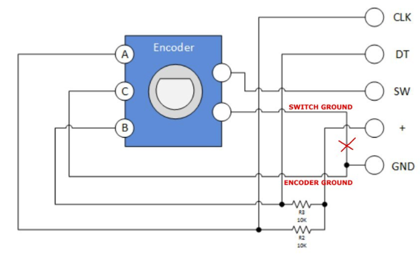

## Hardware
### Wiring

**Exploring Rotary Encoders with Push Button**

Rotary encoders with push buttons are versatile sensors commonly used in various electronic applications. Let's delve into what they are, how they work, and their applications.

**What is a Rotary Encoder with Push Button?**
A rotary encoder with a push button is a type of electromechanical device that converts rotational motion into digital signals. It consists of two main components: the encoder itself, which tracks the rotational movement, and a push button integrated into the encoder's shaft or housing.

**How Does it Work?**
The rotary encoder generates digital signals based on the direction and speed of rotation. It typically employs one of two encoding methods:
- Incremental: Incremental rotary encoders produce digital pulses as the shaft rotates. These pulses indicate the direction and amount of rotation but do not provide absolute position information.
- Absolute: Absolute rotary encoders provide unique digital codes for each position of the shaft, allowing the precise determination of the shaft's absolute position.

The push button, when pressed, generates a separate signal indicating a user input or command.

**Applications**
Rotary encoders with push buttons find applications in various fields, including:
- Human-Machine Interface (HMI) devices: Used in control panels, knobs, and dials for user interaction.
- Robotics: Utilized for position sensing in robotic joints and actuators.
- Automotive: Integrated into vehicle controls such as steering wheels and audio systems.
- Consumer Electronics: Found in volume controls, navigation interfaces, and gaming controllers.

**Benefits**
- Precision: Rotary encoders provide precise position feedback, making them suitable for applications requiring accurate rotational control.
- Durability: Built with robust construction, rotary encoders can withstand continuous operation in harsh environments.
- Versatility: Available in various sizes, resolutions, and encoding methods, rotary encoders with push buttons offer flexibility for different applications.

**Getting Started**
To incorporate a rotary encoder with a push button into your projects, you'll need to understand its electrical connections and communication protocols. By interfacing it with microcontrollers like Arduino or Raspberry Pi, you can harness its capabilities to create interactive devices, control systems, and more.

**Conclusion**
Rotary encoders with push buttons are essential components in the realm of electronics, offering precise rotational sensing and user input functionalities. Whether you're designing a control interface, a robotics project, or a consumer electronics device, understanding and leveraging the capabilities of rotary encoders can enhance your project's functionality and user experience.

## Chat Description
Imagine you have a magical knob, like the one you find on a radio or a volume control. This special knob is called a rotary encoder. It's not just an ordinary knob; it can do something really cool!

**A rotary encoder is like a smart knob that can tell you not just which way it's turning but also how much it's turning.**

Here's how it works:

1. **Turning Direction:**
    - When you turn the knob to the right, it sends a signal saying, "Hey, I'm turning to the right!"
    - When you turn it to the left, it says, "Guess what? I'm turning to the left!"
2. **Amount of Turning:**
    - The encoder can also tell you how much it's turning. It's like saying, "I'm turning a little bit" or "I'm turning a lot!"

So, if you connect this magical knob to something like a computer or a robot, it can understand not just which way you're turning it but also how fast or slow, and how much.

People use rotary encoders in all sorts of cool things. For example, you can use it to change the volume on your music player, navigate through a menu on a screen, or even control a robot's movement.

In simple terms, a rotary encoder is a clever knob that helps you give instructions to your electronic gadgets by turning it left or right and sometimes even pushing it like a button!

