#  20kw_Recup_Rect Cycle Deck

Massflow

Turbine_Exit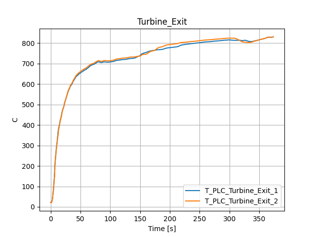

Inlet_Temperature

Pressure_Ratio

N1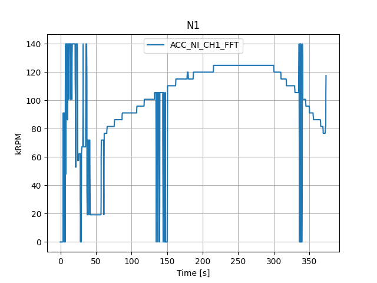

N2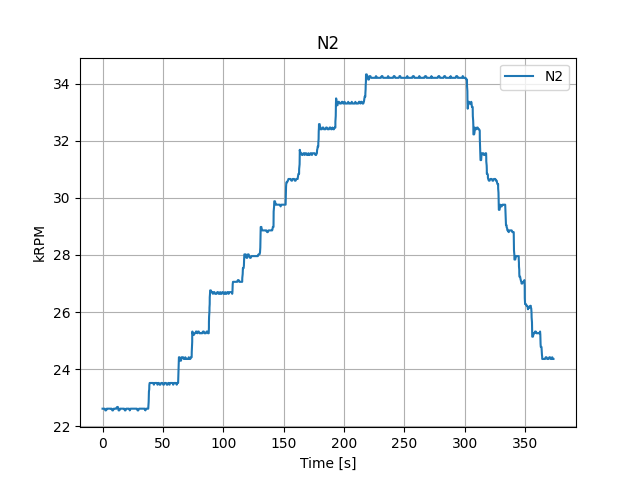

Power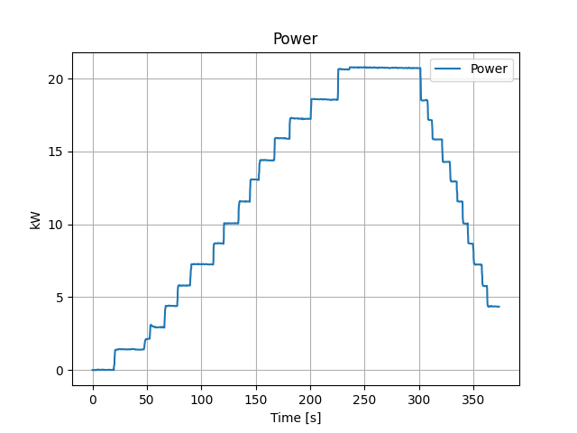

Leakage

Compressor_Efficiency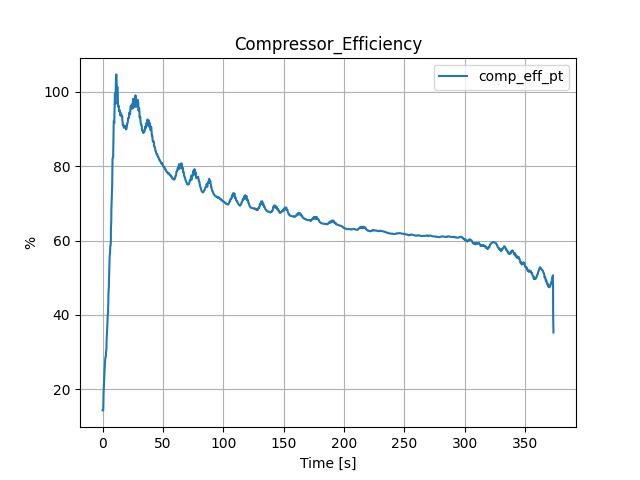

P_Combined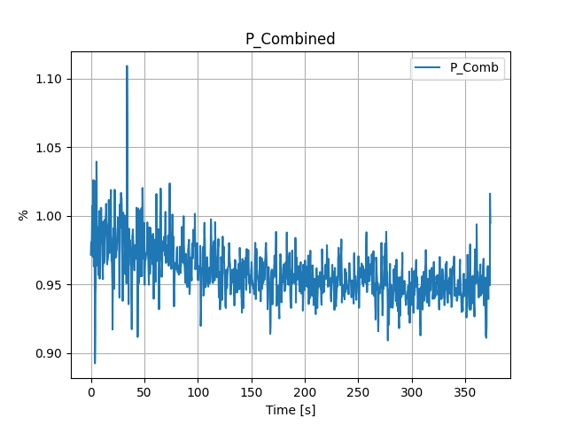

P_LP_Inlet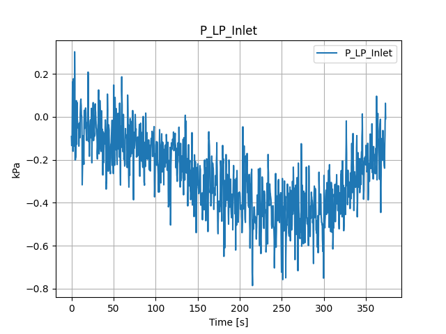

P_LP_Outlet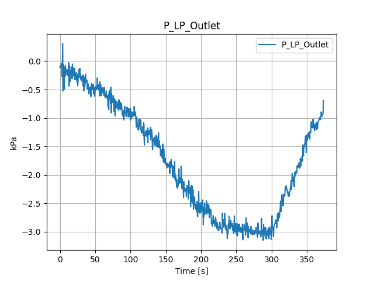

T_LP_Inlet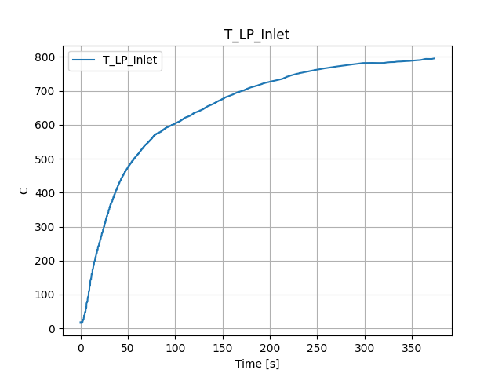

T_HP_Outlet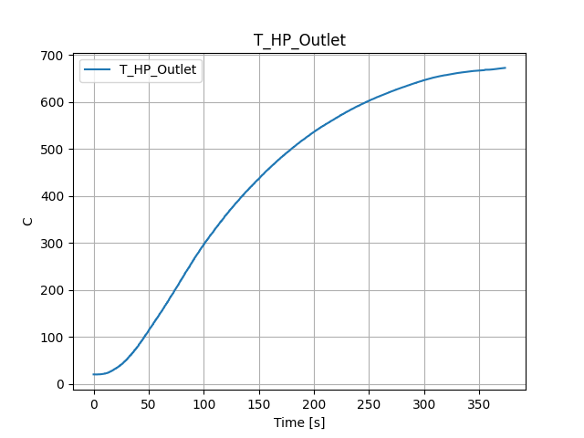

T_HP_Inlet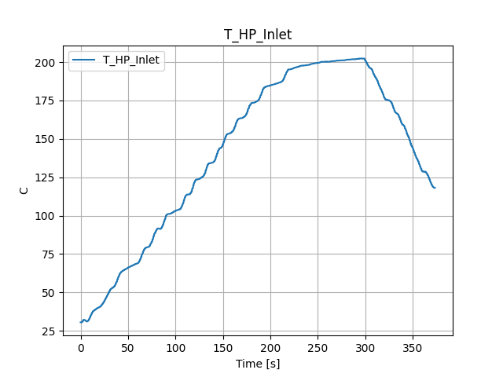

T_LP_Outlet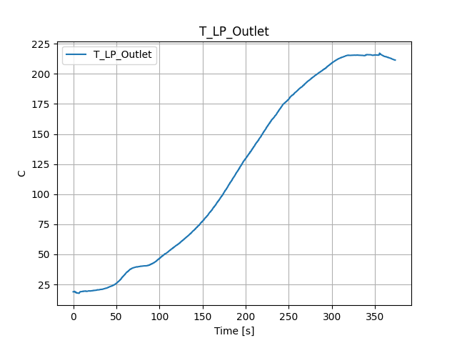

Fuel_Flowrate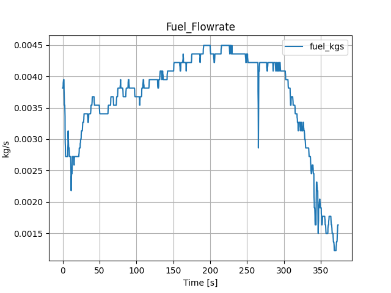

Efficiency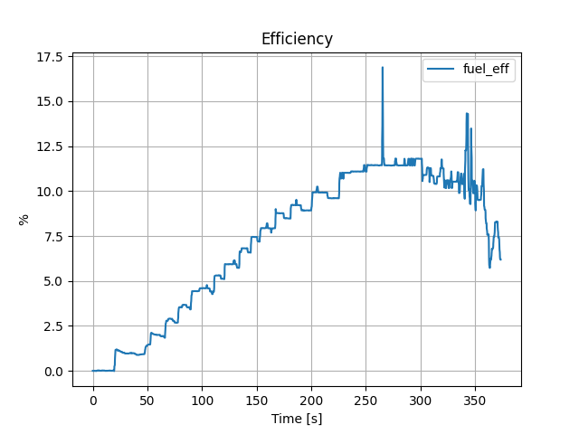

 Averages over period: 260 to 275s

|    | Title                 |          Avg | Units   |
|---:|:----------------------|-------------:|:--------|
|  0 | Massflow              |   0.360697   | kg/s    |
|  1 | Turbine_Exit          | 807.529      | C       |
|  2 | Inlet_Temperature     |  18.9671     | C       |
|  3 | Pressure_Ratio        |   3.10277    | %       |
|  4 | N1                    | 124.8        | kRPM    |
|  5 | N2                    |  34.2095     | kRPM    |
|  6 | Power                 |  20.7489     | kW      |
|  7 | Leakage               |  -5.19715    | %       |
|  8 | Compressor_Efficiency |  61.269      | %       |
|  9 | P_Combined            |   0.95223    | %       |
| 10 | P_LP_Inlet            |  -0.4344     | kPa     |
| 11 | P_LP_Outlet           |  -2.96693    | kPa     |
| 12 | T_LP_Inlet            | 770.434      | C       |
| 13 | T_HP_Outlet           | 619.895      | C       |
| 14 | T_HP_Inlet            | 200.72       | C       |
| 15 | T_LP_Outlet           | 190.786      | C       |
| 16 | Fuel_Flowrate         |   0.00415741 | kg/s    |
| 17 | Efficiency            |  11.6494     | %       |