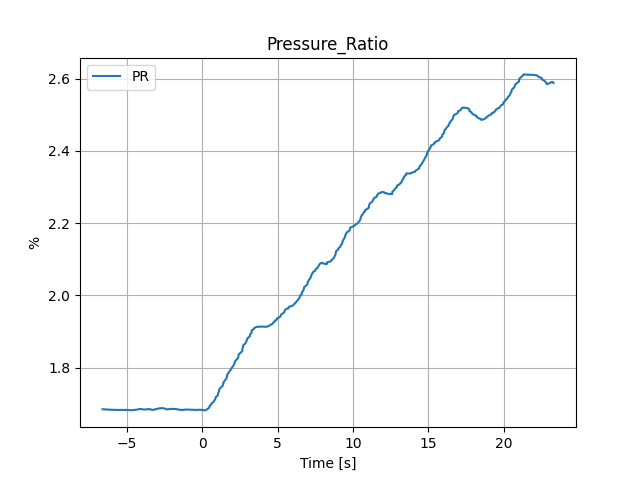
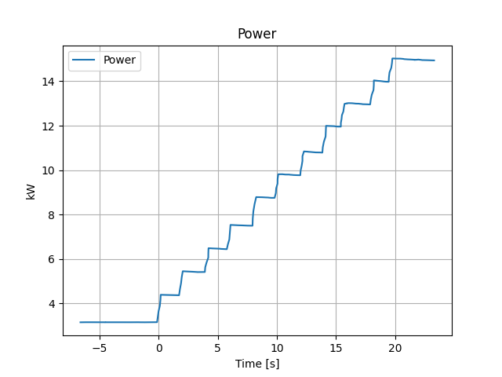
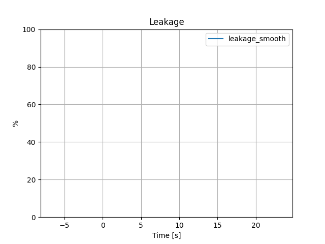
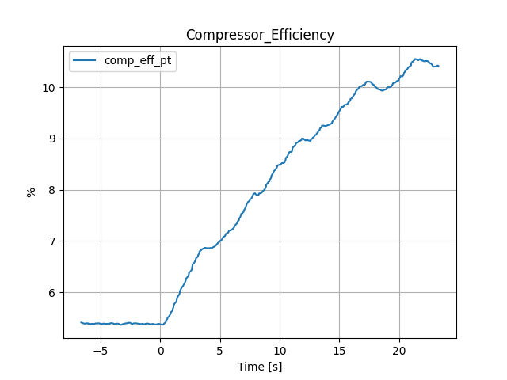
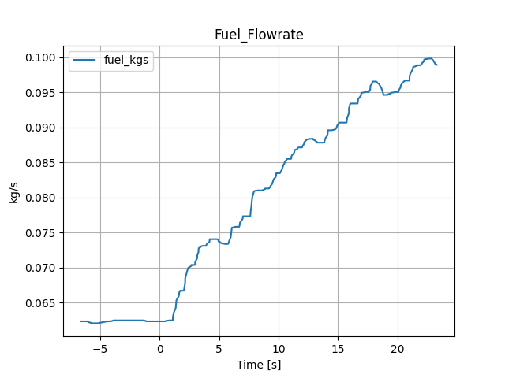
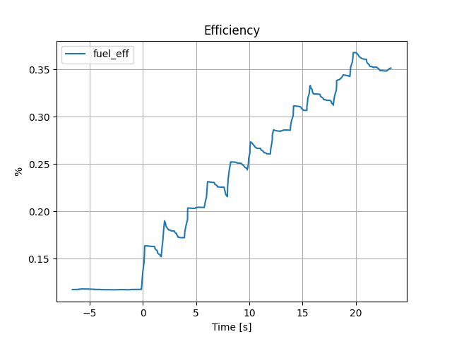
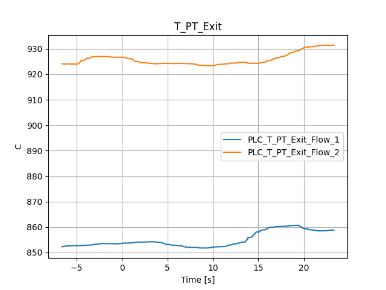

#  12kRamp Cycle Deck

Pressure_Ratio

Power

Leakage

Compressor_Efficiency

Fuel_Flowrate

Efficiency

T_PT_Exit

 Averages over period: -6.612017000000037 to 23.307319000000007s

|    | Title                 |         Avg | Units   |
|---:|:----------------------|------------:|:--------|
|  0 | Pressure_Ratio        |   2.10704   | %       |
|  1 | Power                 |   8.54771   | kW      |
|  2 | Leakage               | -15.8708    | %       |
|  3 | Compressor_Efficiency |   7.86049   | %       |
|  4 | Fuel_Flowrate         |   0.0795983 | kg/s    |
|  5 | Efficiency            |   0.235742  | %       |
|  6 | T_PT_Exit             | 855.02      | C       |