#  20kw_Recuperated Cycle Deck

Massflow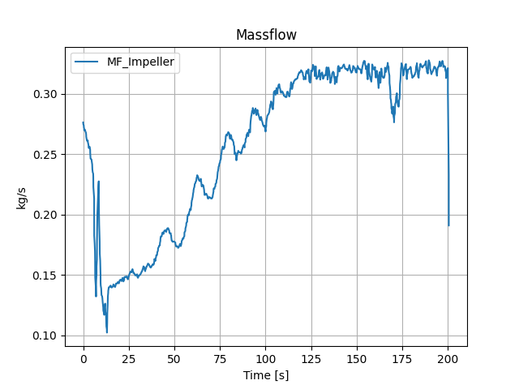

Turbine_Exit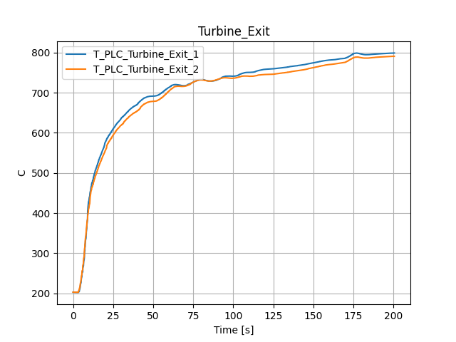

Inlet_Temperature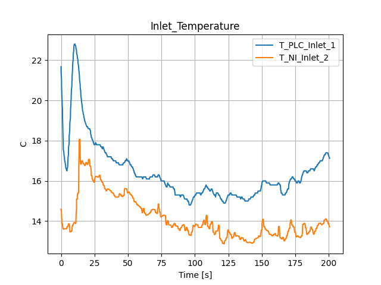

Pressure_Ratio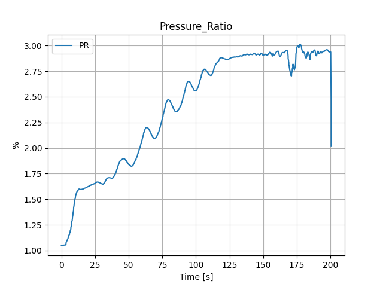

N1

N2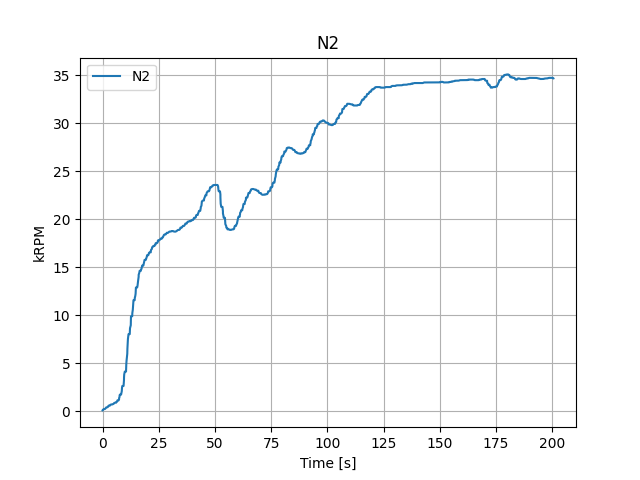

Power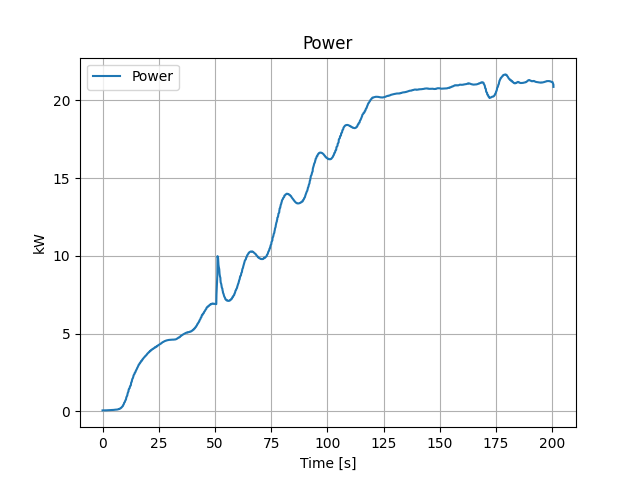

Leakage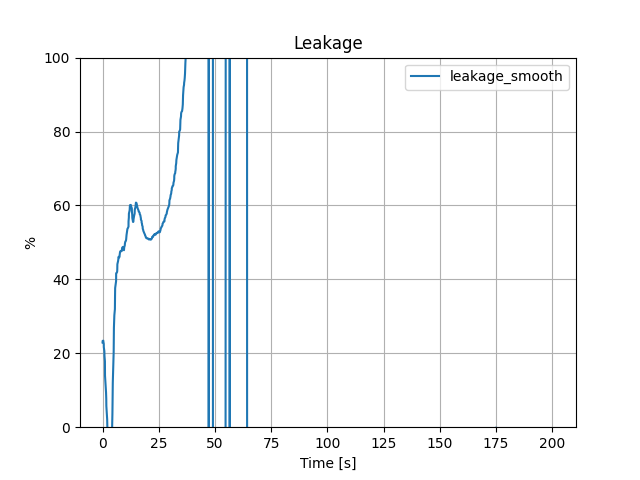

Compressor_Efficiency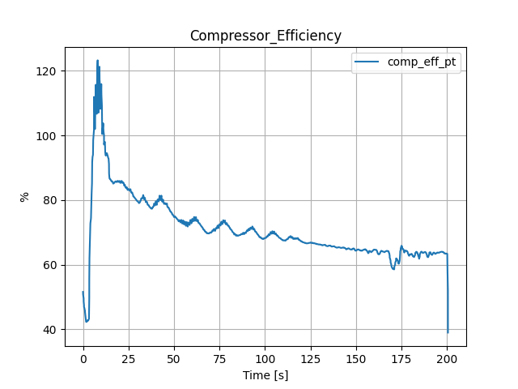

P_Combined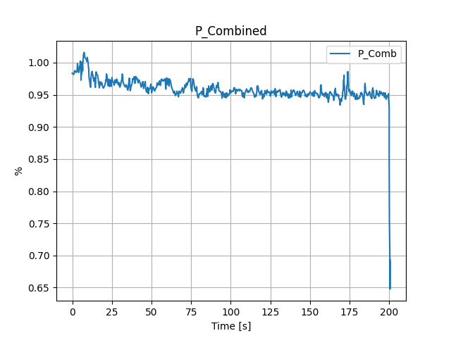

P_LP_Inlet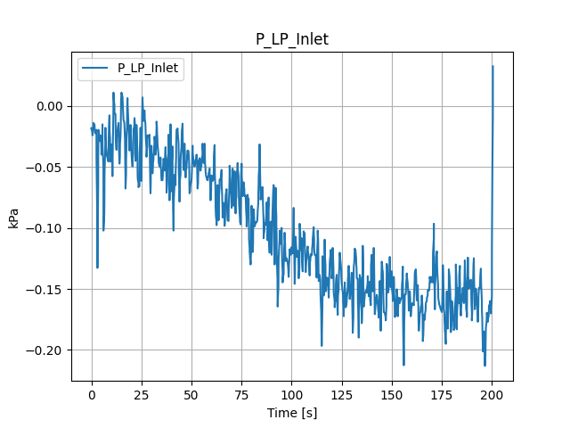

P_LP_Outlet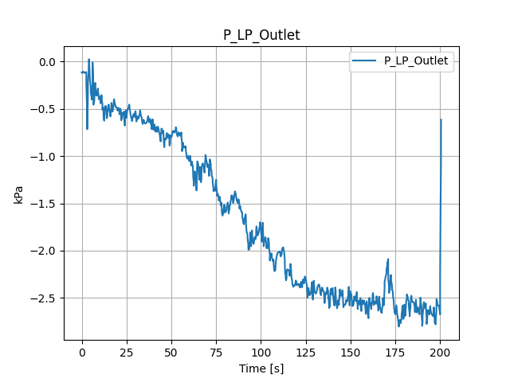

T_LP_Inlet

T_HP_Outlet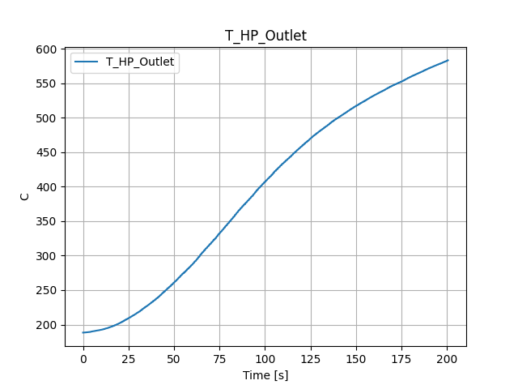

T_HP_Inlet

T_LP_Outlet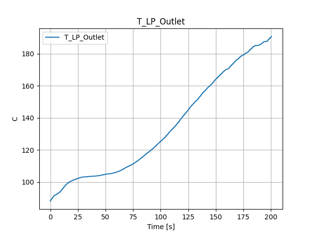

Fuel_Flowrate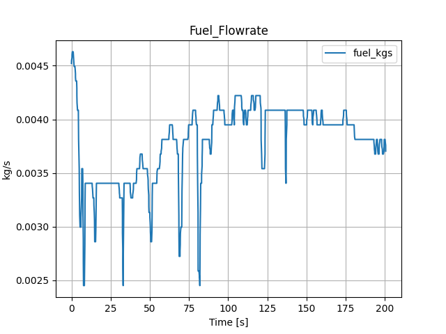

Efficiency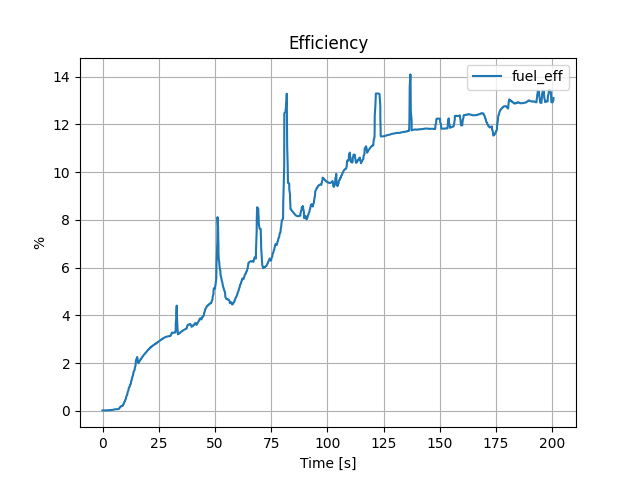

 Averages over period: 181 to 195s

|    | Title                 |          Avg | Units   |
|---:|:----------------------|-------------:|:--------|
|  0 | Massflow              |   0.320577   | kg/s    |
|  1 | Turbine_Exit          | 796.199      | C       |
|  2 | Inlet_Temperature     |  16.6442     | C       |
|  3 | Pressure_Ratio        |   2.92419    | %       |
|  4 | N1                    | 104.251      | kRPM    |
|  5 | N2                    |  34.6912     | kRPM    |
|  6 | Power                 |  21.1989     | kW      |
|  7 | Leakage               |  -2.3413     | %       |
|  8 | Compressor_Efficiency |  63.357      | %       |
|  9 | P_Combined            |   0.95079    | %       |
| 10 | P_LP_Inlet            |  -0.153749   | kPa     |
| 11 | P_LP_Outlet           |  -2.59761    | kPa     |
| 12 | T_LP_Inlet            | 750.744      | C       |
| 13 | T_HP_Outlet           | 568.813      | C       |
| 14 | T_HP_Inlet            | 178.39       | C       |
| 15 | T_LP_Outlet           | 185.341      | C       |
| 16 | Fuel_Flowrate         |   0.00380177 | kg/s    |
| 17 | Efficiency            |  12.9685     | %       |