#  30_kW Cycle Deck

Massflow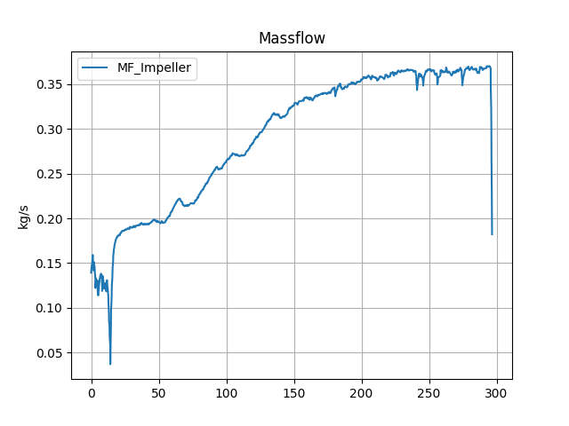

Turbine_Exit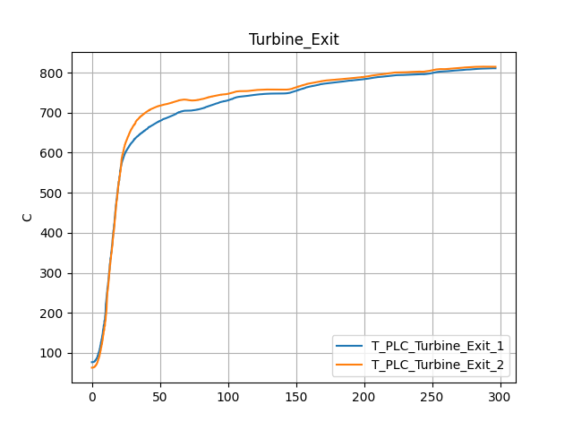

Inlet_Temperature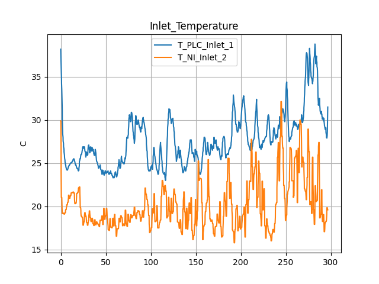

Pressure_Ratio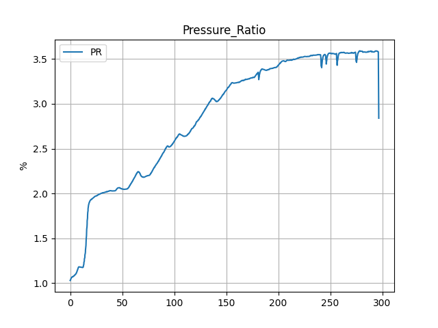

N1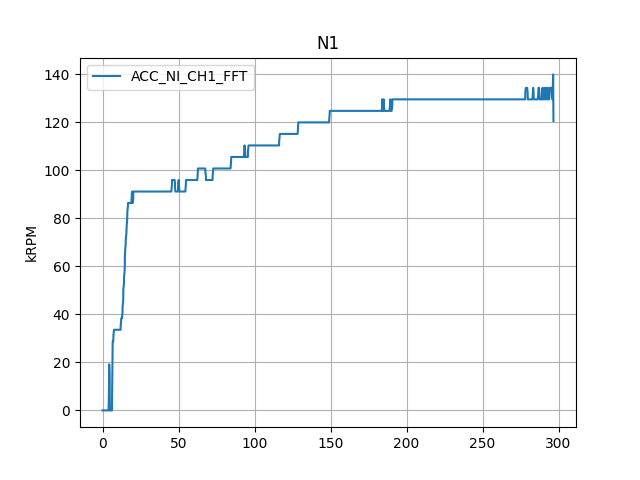

N2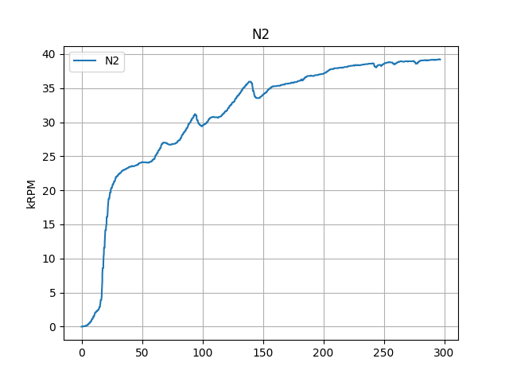

Power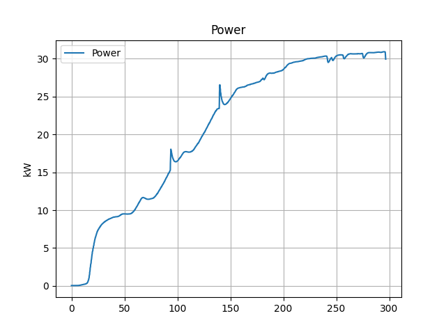

Leakage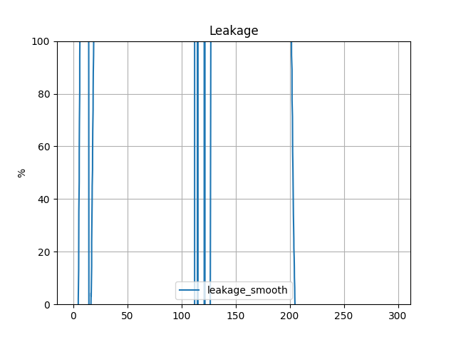

Compressor_Efficiency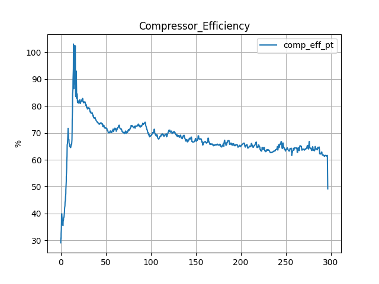

P_Combined

Fuel_Flowrate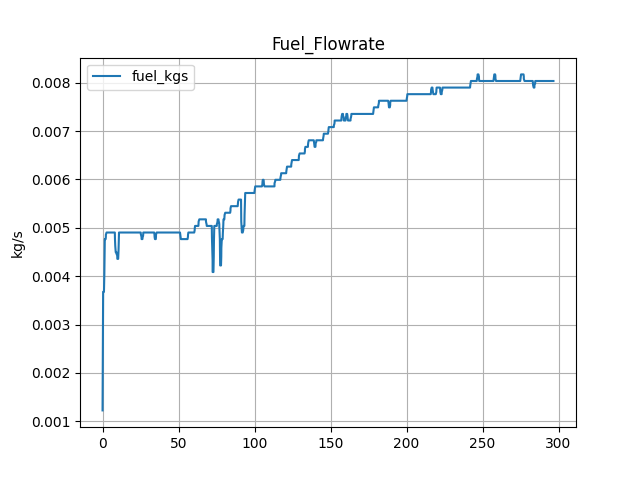

Efficiency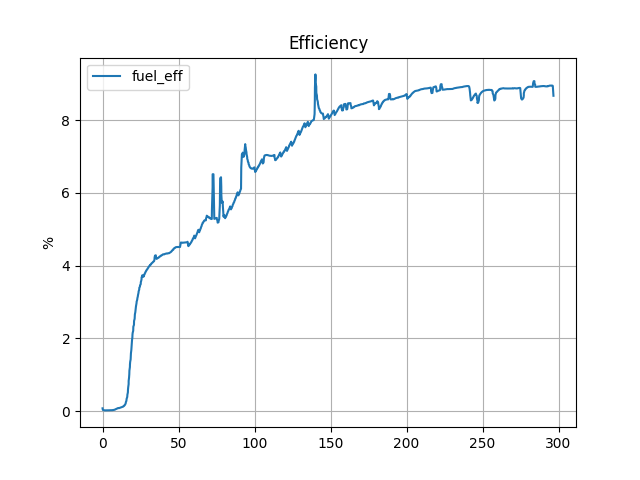

 Averages over period: 250 to 275s

|    | Title                 |          Avg | Units   |
|---:|:----------------------|-------------:|:--------|
|  0 | Massflow              |   0.362969   | kg/s    |
|  1 | Turbine_Exit          | 803.784      | C       |
|  2 | Inlet_Temperature     |  30.9011     | C       |
|  3 | Pressure_Ratio        |   3.56094    | %       |
|  4 | N1                    | 129.6        | kRPM    |
|  5 | N2                    |  38.8138     | kRPM    |
|  6 | Power                 |  30.5435     | kW      |
|  7 | Leakage               | -67.6951     | %       |
|  8 | Compressor_Efficiency |  64.0242     | %       |
|  9 | P_Combined            |   0.282872   | %       |
| 10 | Fuel_Flowrate         |   0.00803834 | kg/s    |
| 11 | Efficiency            |   8.8367     | %       |