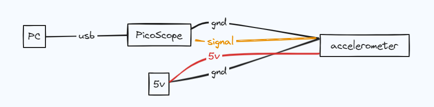

# Generator Spin

### Hardware
- [PicoScope](https://www.amazon.com/dp/B011ON5XOY?psc=1&ref=product_details)
- [Accelerometer](https://www.digikey.com/en/products/detail/analog-devices-inc./EVAL-ADXL1002Z/7200822?utm_adgroup=Development%20Boards%2C%20Kits%2C%20Programmers&utm_source=google&utm_medium=cpc&utm_campaign=Shopping_Supplier_Analog%20Devices_8100_Co-op&utm_term=&utm_content=Development%20Boards%2C%20Kits%2C%20Programmers&gclid=CjwKCAiAvaGRBhBlEiwAiY-yMKbCCGeqahIJq6pl64TjcG2tbxmcvTIvTBEXUAEmHKHZ-XajbgNB9BoC6QgQAvD_BwE)
  - ratiometric output... +- 50g
  - 50/2.5 = 20g/V
  
---
### Example Dataset
- Spun 25kW generator to 15 krpm
- RMS = Root Mean Squared. Represents overall magnitude of signal
- FFT not able to get reliable reading 
- Clear correlation with RMS and speed
  - however voltage reading difference is very small 
  - .01v*20g/v = .2g

---

### Accelerometer Mounting
#### 3d Printed mount

#### Generator Mounting

---
### Diagram
