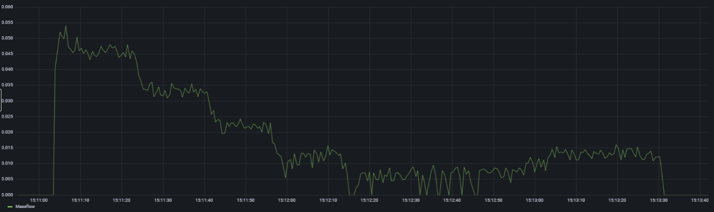
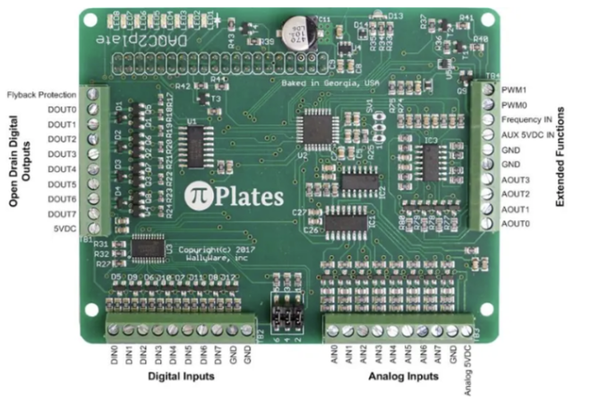

## Test Layout

### Air System
Target 0.013 kg/s of air massflow. Achieved with:
- TorqAmp at 43%
- Sanitary adjustment valve at 25% open
- [Influx Data](http://192.168.0.101:3000/d/p8P4tKFIk/bts?orgId=1&from=1704928254450&to=1704928422097)
- 

1. TorqAmp
2. Sanitary adjustment valve
   1. [Amazon](https://www.amazon.com/gp/product/B087NHXSTX/ref=ppx_yo_dt_b_asin_title_o00_s00?ie=UTF8&psc=1)
   2. Backpressure torqamp to achieve desired flowrate
3. TurboWastegate
   1. Adjust to desired position... ends up being full open
4. Venturi
   1. Measure pressure drop across venturi
   2. Calculate flowrate
5. Feed into test article

### CO2 System
1. CO2 Tank
2. Solenoid
3. [Pressure Regulator](https://www.omega.com/en-us/control-monitoring/controllers/pressure-regulators/ip610/p/IP610-0120)
   1. Fuel Tank
   2. CO2 Purge

### Fuel System
Pressure fed fuel system using CO2 to pressurize fuel tank.
1. Fuel Tank
   1. Pressure 
   2. Pressure Relief
   3. Purge Solenoid
2. Solenoid
3. Manifold
   1. Pressure
   2. Temperature
   3. Heater
4. Flow Sensor
5. Test Article
   1. Spillback return
      1. Solenoid 
      2. Flow Sensor
   2. xx return
      1. pressure
6. Catch Tank
7. Check valve
8. Solenoid 

## Controls
### Pi Server
- IP Address: 192.168.0.33
