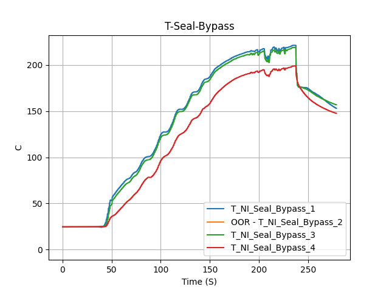
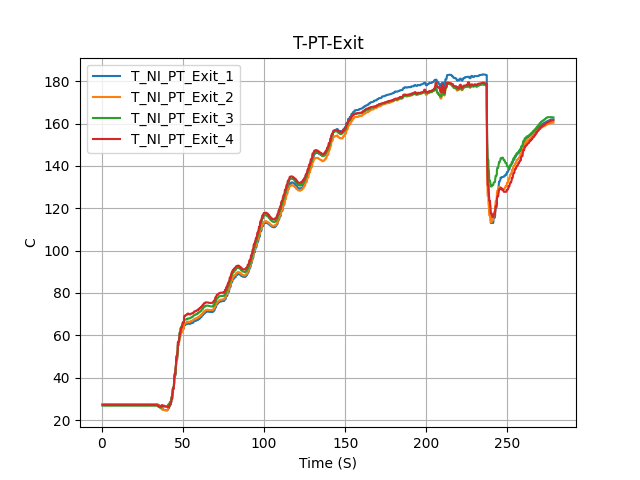
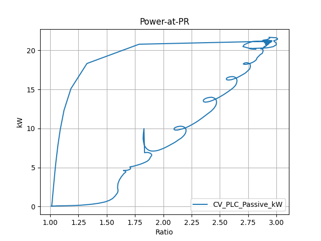

- [1-Control](#1-control)
- [2-Electrical](#2-electrical)
- [3-Temperatures](#3-temperatures)
- [4-Pressures](#4-pressures)
- [5-Fuel](#5-fuel)
- [6-Fluid_Systems](#6-fluid_systems)
- [7-Other](#7-other)
- [8-Calculations](#8-calculations)

# 1-Control

| | | |
|---|---|---|
||||
|

# 2-Electrical

| | | |
|---|---|---|
||||

# 3-Temperatures

| | | |
|---|---|---|
||||
|||||
|||||
|

# 4-Pressures

| | | |
|---|---|---|
||||
|||||
|||

# 5-Fuel

| | | |
|---|---|---|
||||
||

# 6-Fluid_Systems

| | | |
|---|---|---|
||||
|

# 7-Other

| | | |
|---|---|---|
||||

# 8-Calculations

| | | |
|---|---|---|
||

