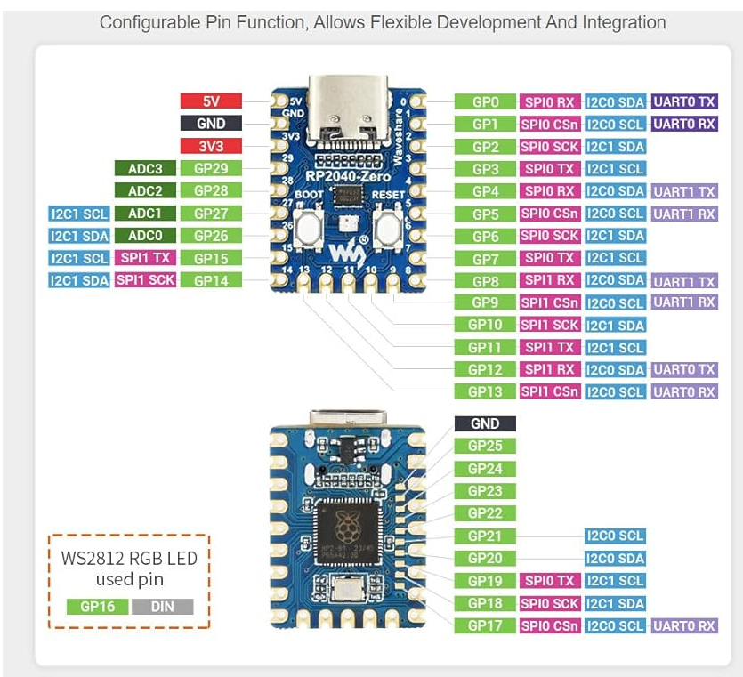

# Micro Controllers

## Raspberry PI
- Raspberry Pi
- Pi Pico

- [Camera](https://www.amazon.com/Raspberry-Camera-Module-Megapixels-Sensor/dp/B07L82XBNM/ref=sr_1_4?crid=22JZH5O0PMCGI&dib=eyJ2IjoiMSJ9.wE_fcNoA3pjNah_vO_Ta5LmknGg0Sn4KziJST-UkzFnlSB2XKVqi-UId0puflGD8ASDEB9rFQsKSKSAtS7TuPG84jrma_XJxlZJdqyjqr4LZ7r07YES0nF49pKXFwgH8Q6LlHU_wCLjCRe3GY-lG1zTuJqcchif_Wr7Y70pu29DzX8YSGzw1I2-RwAYcdeLMMtFHKwEqW_IEQue-oQS3fEn44JpO8dgzozeA3Odi8RU.V87URlkr2Opzydoxc51WFtjqQOJBN245RvyRnZMYs2A&dib_tag=se&keywords=raspberry+pi+camera&qid=1710822087&sprefix=raspberry+pi+camera%2Caps%2C145&sr=8-4)?
- 

## CircuitPython
- 

- Rot Encoders
- 0,1,2
- 3,4,5

## Matrix Comms

### Colors
- R1 -6
- G1 7
- B1 8
- R2 9
- G2 10
- B2 11

### Adress
- A 12
- B 13
- C 14
- D 15
- E 26

- CLK 27
- LAT 28

- GND
- GND
- GND
- 

**Introduction to Microcontrollers**

Welcome to the world of microcontrollers! In this introductory section, we'll explore the fundamentals of microcontrollers, their applications, and why they're essential in today's technology-driven world.

**What is a Microcontroller?**
A microcontroller is a small computer on a single integrated circuit containing a processor core, memory, and programmable input/output peripherals. Unlike traditional computers, which are general-purpose and designed for various tasks, microcontrollers are specialized for embedded systems and perform specific functions within devices and systems.

**Applications of Microcontrollers**
Microcontrollers are ubiquitous in modern technology and play a crucial role in numerous applications, including:
- Home automation systems
- Robotics
- Internet of Things (IoT) devices
- Automotive electronics
- Medical devices
- Consumer electronics
- Industrial automation

**Key Features of Microcontrollers**
Microcontrollers come with various features and capabilities that make them versatile for different applications:
- Low power consumption: Ideal for battery-powered devices and energy-efficient systems.
- On-chip peripherals: Integrated peripherals such as timers, analog-to-digital converters, and communication interfaces simplify hardware design.
- Real-time operation: Ability to execute tasks in real-time, making them suitable for time-critical applications.
- Programmability: Microcontrollers can be programmed to perform specific tasks using software written in programming languages like C/C++ and Python.

**Why Learn about Microcontrollers?**
Understanding microcontrollers opens up a world of opportunities for innovation and creativity. Whether you're a hobbyist, student, or professional, learning about microcontrollers enables you to:
- Build interactive projects and prototypes
- Gain practical skills in electronics and programming
- Explore emerging technologies like IoT and robotics
- Solve real-world problems through creative engineering solutions

**Getting Started**
Ready to dive into the exciting world of microcontrollers? Whether you're a beginner or an experienced enthusiast, this introductory guide will equip you with the knowledge and skills to embark on your journey. Let's start exploring the endless possibilities that microcontrollers offer!

*Stay tuned as we delve deeper into microcontrollers, exploring programming, hardware interfaces, project tutorials, and much more!*

## Chat Description
Imagine you have a little computer friend called a microcontroller. This friend is really good at following instructions and can help you control things in the real world, like turning on lights or making sounds. One way your microcontroller does this is through something called GPIO.

**GPIO stands for General Purpose Input/Output.**

Now, what does that mean? Well, think of it like magic buttons on your microcontroller. Each button can either send a signal out (Output) or receive a signal in (Input).

- **Output (O):** It's like telling your microcontroller to do something. For example, if you press a button that says "Turn on the LED," your microcontroller sends a signal to make the LED light up.
- **Input (I):** This is like your microcontroller listening for something to happen. Imagine a button that says "Detect if it's dark." Your microcontroller can "listen" to a sensor and figure out if it's dark or bright.

So, GPIO pins are like the special buttons on your microcontroller that let it talk to the outside world. You can connect things like lights, sensors, or even little motors to these buttons and tell your microcontroller what you want it to do.

It's like giving your microcontroller a magical control panel to interact with the world around it! And when you learn how to use GPIO, you can make your microcontroller do all sorts of fun and useful things.
