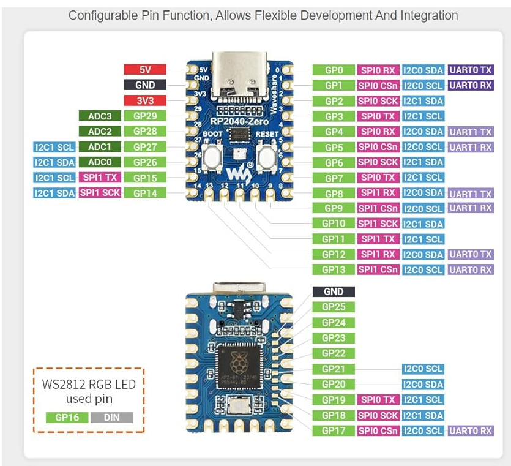

# Micro Controllers

## Raspberry PI
- Raspberry Pi
- Pi Pico

- [Camera](https://www.amazon.com/Raspberry-Camera-Module-Megapixels-Sensor/dp/B07L82XBNM/ref=sr_1_4?crid=22JZH5O0PMCGI&dib=eyJ2IjoiMSJ9.wE_fcNoA3pjNah_vO_Ta5LmknGg0Sn4KziJST-UkzFnlSB2XKVqi-UId0puflGD8ASDEB9rFQsKSKSAtS7TuPG84jrma_XJxlZJdqyjqr4LZ7r07YES0nF49pKXFwgH8Q6LlHU_wCLjCRe3GY-lG1zTuJqcchif_Wr7Y70pu29DzX8YSGzw1I2-RwAYcdeLMMtFHKwEqW_IEQue-oQS3fEn44JpO8dgzozeA3Odi8RU.V87URlkr2Opzydoxc51WFtjqQOJBN245RvyRnZMYs2A&dib_tag=se&keywords=raspberry+pi+camera&qid=1710822087&sprefix=raspberry+pi+camera%2Caps%2C145&sr=8-4)?
- 

## CircuitPython
- 

- Rot Encoders
- 0,1,2
- 3,4,5

## Matrix Comms

### Colors
- R1 -6
- G1 7
- B1 8
- R2 9
- G2 10
- B2 11

### Adress
- A 12
- B 13
- C 14
- D 15
- E 26

- CLK 27
- LAT 28

- GND
- GND
- GND
- 