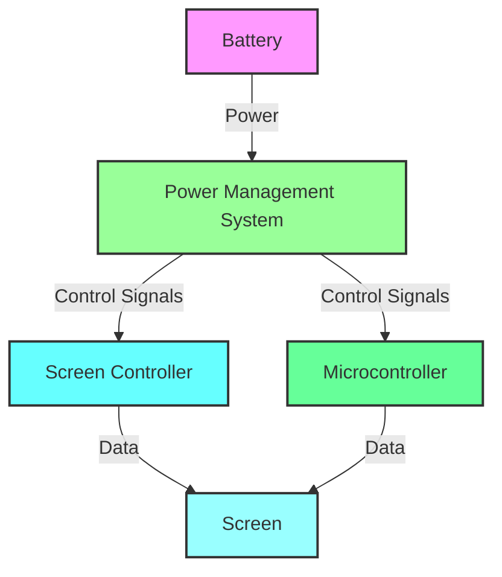
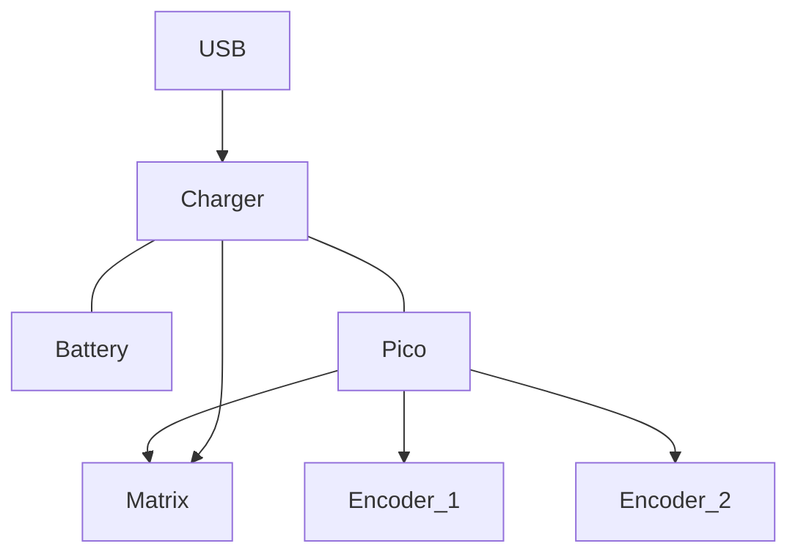

Here's the Mermaid diagram with colored wiring:

- [batteries](batteries)

In this diagram:
- **Battery** has a light pink fill color (#f9f).
- **Power Management System** has a light green fill color (#9f9).
- **Screen Controller** has a light blue fill color (#6ff).
- **Screen** has a light cyan fill color (#9ff).
- **Microcontroller** has a light greenish-blue fill color (#6f9).

Feel free to adjust the colors and styles as needed to match your design preferences! Let me know if you need any further customization.